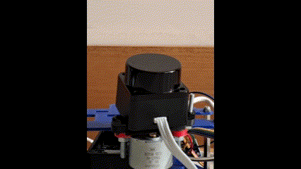
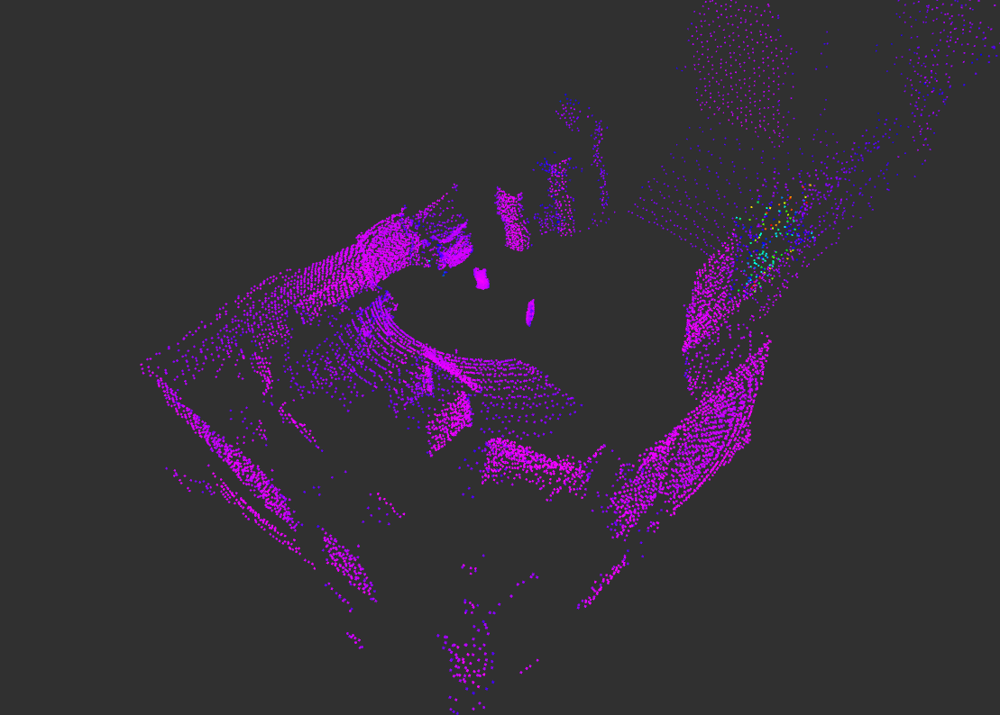
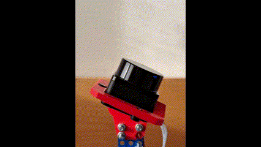
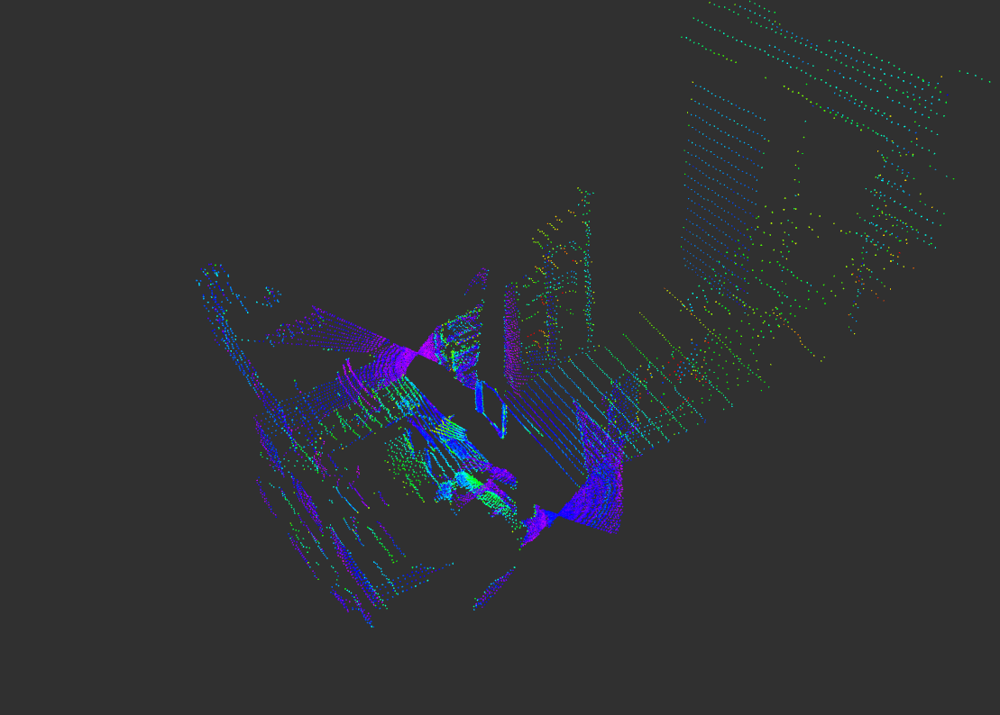

# Rotating 2D LiDAR scan accumulator for ROS2

## Overview

This ROS 2 package, processes data from a back-and-forth rotating 2D LiDAR and generates a 3D point cloud. It subscribes to LaserScan and JointState topics, accumulates LiDAR scans as layers, and publishes a consolidated point cloud. It is designed for use with systems that feature a rotating 2D LiDAR.

## Features

- Converts 2D LiDAR scans into 3D point clouds.
- Supports organized and unorganized point cloud outputs.
- Configurable mechanical offsets and rotation parameters.
- Handles scan velocity changes to detect new sweeps.
- Publishes point clouds in the `sensor_msgs/msg/PointCloud2` format.

## Dependencies

This project requires the following libraries:
- [Eigen3](https://eigen.tuxfamily.org): For matrix and vector operations.
- [PCL (Point Cloud Library)](https://pointclouds.org/): For point cloud processing.
- [ROS 2 Humble](https://docs.ros.org/en/humble/index.html): For robot middleware and communication.

## Run the node

The node can be used with many configurations of a rotating back-and-forth LiDAR.

### Launch with `conf0` Mode

In the **conf0** configuration, the LiDAR is tilted of a 15 degrees and rotates along the vertical axis. It generates a point cloud similar to that of a mechanical 3D LiDAR (e.g., Velodyne Puck VLP-32).

<p float="left">
    
    
</p>
Launch the node using the parameters in `config/conf0.yaml`:

```bash
ros2 launch rotating_lidar_accumulator accumulator_conf0.launch.py
```

### Launch with `conf1` Mode

In the **conf1** configuration, the LiDAR rotates along the x-axis in a up-and-down motion. It generates a point cloud with a high density of points along the additional rotation axis.

<p float="left">
    
    
</p>

To launch the node with the parameters in `config/conf1.yaml`, run:

```bash
ros2 launch rotating_lidar_accumulator accumulator_conf1.launch.py
```

## Parameters

| Parameter Name                   | Description                                         | Default Value                     |
|----------------------------------|-----------------------------------------------------|-----------------------------------|
| `mech.lidar_offset_xyz_m`        | LiDAR positional offset in meters (x, y, z).       | `[0.0, 0.0, 0.0]`                |
| `mech.lidar_offset_ypr_deg`      | LiDAR orientation offset in degrees (yaw, pitch, roll). | `[0.0, 0.0, 0.0]`            |
| `mech.rotation_axis`             | Axis of rotation for the LiDAR (x, y, z).          | `[0.0, 1.0, 0.0]`                |
| `pointcloud.topic.out`           | Name of the output topic.                           | `/pointcloud`                |
| `pointcloud.ordered`             | Generate organized point clouds (true/false).      | `false`                          |
| `pointcloud.lidar_angular_res_deg` | Angular resolution of the 2D LiDAR in degrees.    | `0.225`                          |
| `pointcloud.max_num_layers`      | Maximum number of scan layers.              | `200`                            |

## Topics

### Subscribed Topics

| Topic Name       | Message Type                         | Description                                      |
|------------------|--------------------------------------|--------------------------------------------------|
| `/scan`          | `sensor_msgs/msg/LaserScan`         | LiDAR scan data.                                |
| `/angle`         | `sensor_msgs/msg/JointState`        | Rotational angle and velocity of the LiDAR (in rad).     |

The node uses `rclcpp::SensorDataQoS` for subscribers to prioritize low-latency communication for sensor data.
### Published Topics

| Topic Name       | Message Type                         | Description                                      |
|------------------|--------------------------------------|--------------------------------------------------|
| `/pointcloud`    | `sensor_msgs/msg/PointCloud2`       | Generated 3D point cloud.                       |

